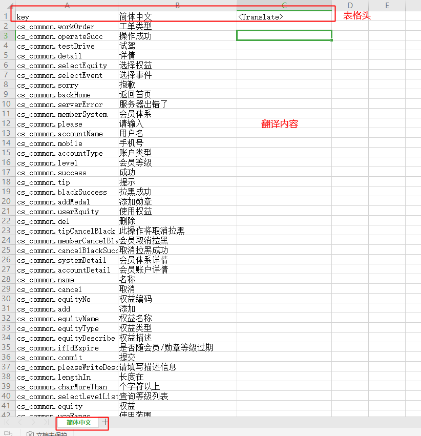
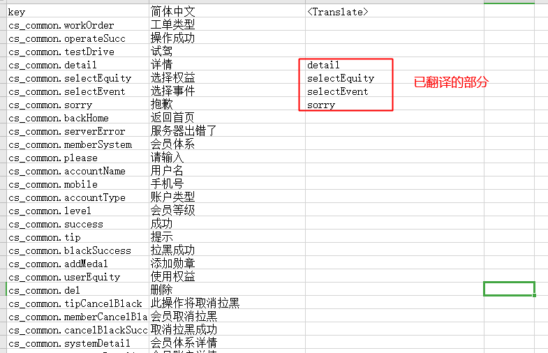
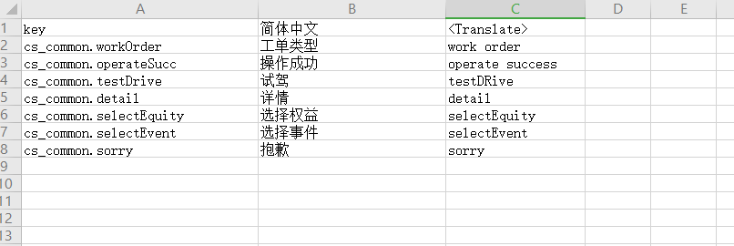
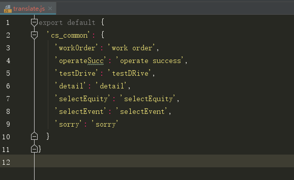

## 项目国际化处理工具

### 项目中中文的提取与国际化写入脚本使用手册

> 1. 目前脚本 **仅支持 components 与 pages 里的 .vue 文件和 .js 文件** 中的中文提取与写入，如果涉及其他文件夹下的内容，可根据脚本内容进行修改对应需要处理的文件内容
> 2. 目前支持 vue 项目
> 3. 写入的脚本需 **本地 node 环境版本不能低于 10.12.0**

### 从项目中提取所有中文字段并根据 i18n 规则写入项目中

1. 安装工具依赖包

> $ npm i -g i18n-collect-cli

2. 执行 getLang 进行提取中文操作，filename 默认为 zh_cn.json

> $ i18n-cli getlang [src] -f <filename> -d <dir> -i <ignoredir>

+ src 为入口目录
+ filename 为生成的语言文件的文件名，必须为json格式， 默认为zh_cn.json
+ dir 为要收集的文件目录, 默认为 [pages, components]
+ ignoredir 为 dir 目录下被忽略的文件目录

执行完成后会在同级目录下生成一个 zh_cn.json 文件，通过json格式化后（**必须要格式化，否则后续通过 $t 写入项目会报错**），内容格式形同如下：

```js
{
  'cs_common': {
    'cs_1': '用户ID',
    'cs_2': '搜索',
  },
  'cs_error': {
    'cs_3': '请输入小于200字符！',
    'cs_4': '请正确填写年龄([0~120])！'
  }
}
```

3. 将 zh_cn.json 文件中的中文对应的 key 用语义化字符串代替，修改后得到的 zh_cn.json 文件如下

```js
{
  'cs_common': {
    'userId': '用户ID',
    'search": '搜索',
  },
  'cs_error': {
    'maxInput': '请输入小于200字符！',
    'ageTip': '请正确填写年龄([0~120])！'
  }
}
```

4. 执行 writeLang 将中文以 i18n 的模式写入文件（仅支持 components 与 pages 里的 .vue 文件和 .js 文件）

> $ i18n-cli writelang [srcDist] -f <filename> -d <dir> -i <ignoredir>
  
  
+ srcDist 为复制 src 出来的文件夹名
+ filename 为生成的语言文件的文件名，必须为json格式， 默认为zh_cn.json
+ dir 为要替换成 $t 的文件目录, 默认为 [pages, components]
+ ignoredir 为 dir 目录下被忽略的文件目录

> 注：
> 1、非 .vue 文件需要引用 i18n 才能使用
> 2、dir 可以是src下的任意文件目录

执行以上脚本后会在 src 同级目录生成 srcDist 文件夹，文件夹内仅包含 components 与 pages 文件夹下的 .vue 文件和 .js 文件

5. 将 srcDist 文件夹内容替换到 src 文件夹中，覆盖重复的文件

6. 将 zh_cn.json 内数据放入项目中的多语言模块，运行项目，全局遍历一下是否有遗漏


> 注： 以上基于项目中已加入 i18n ，并且已做好配置。

该脚本还不够完善，目前仅支持部分常用模版（如label="用户ID"）的文案提取，有其他使用场景的，可以帮忙补充。

### 国际化语言提取与写入

专业的事情找专业的人做，毕竟不是所有的开发人员都能做翻译。所以会有找相关翻译人员处理国际化语言的需求，估有了此工具，用于提取js文件里的关键数据，转成excel表格交给专业的人进行翻译

#### 国际化语言的提取

1、将语言文件 zh.js 转成 excel 表格，好提供给专业的人进行翻译

> i18n-cli toexcel [url] [translateUrl] [filename] 

url 必填，为js文件的路径
translateUrl 选填，为已经翻译的语言的js，用于提取语言增量
filename 默认为zh.xlsx, 默认保存路径为当前执行命令的路径，且保存路径不可修改

** 注：js中对象的 key 必须带引号，如下**

```js
export default {
  'common': {
    'workOrder': '工单类型',
    'operateSucc': '操作成功',
    'testDrive': '试驾',
    'detail': '详情',
    'selectEquity': '选择权益',
    'selectEvent': '选择事件',
    'sorry': '抱歉'
    ...
  }
  ...
}
```
如果没有选择已经翻译的语言的js时，最后生成的excel表格如下



如果选择了已经翻译的语言的js，如

```js
export default {
  'cs_common': {
    'detail': 'detail',
    'selectEquity': 'selectEquity',
    'selectEvent': 'selectEvent',
    'sorry': 'sorry'
  }
}

```

则生成的 excel 表格如下



此时，将key列隐藏后（防止key值被修改）即可将此 excel 表格提供给专业的人员，做专业的翻译了

#### 多语言的写入

翻译完成后还需将 excel 表格的翻译内容用该脚本处理成js文件，引入到项目中做多语言的展示

1、将翻译好的文件整理成 js 文件

> $ i18n-cli tojs [url] [filename]

   [filename] 多语言js文件，默认 translate.js, 默认当前位置，不能修改存储地址，如xx.js,
   [url] excel文件路径，格式可以为".xls", ".xml",".xlsx",".xlsm"

如 excel 文件内容如下



执行结束后会在根目录生成一个 transform.js 文件，文件内容如下




欢迎issue
